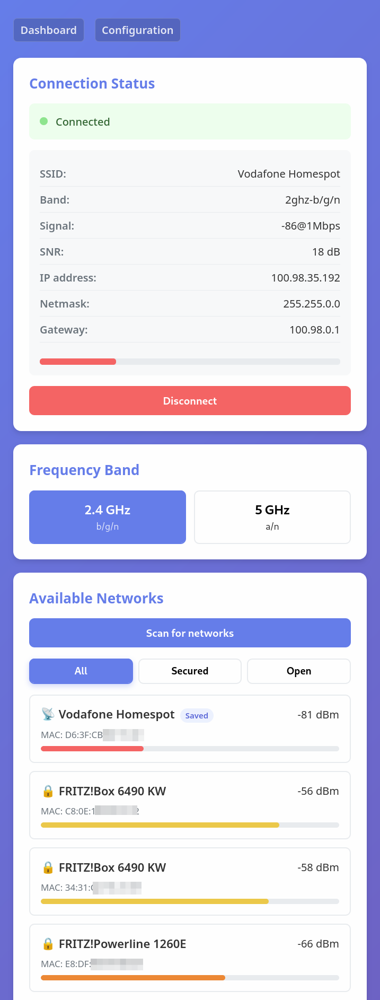
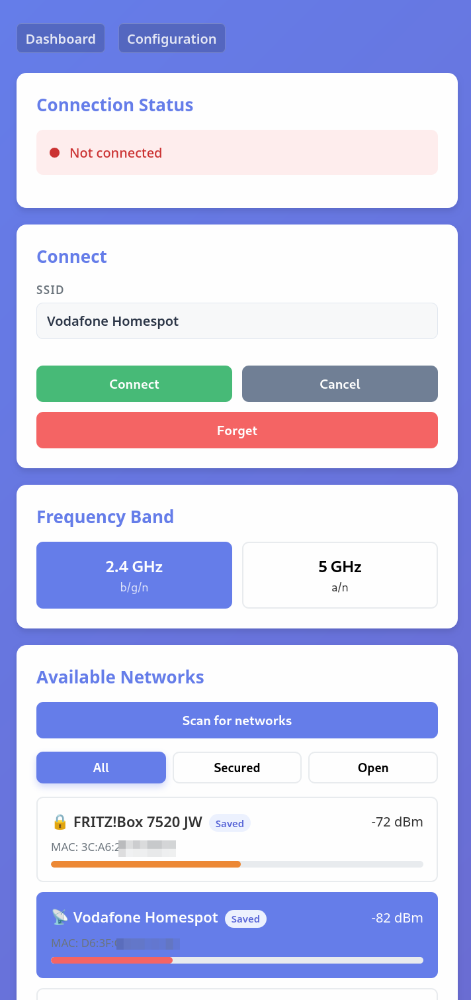

# MikroTik WiFi Manager (ESP32-S2)

MikroTik WiFi Manager turns an ESP32-S2 into a friendly control panel for MikroTik station-mode setups—ideal when you run a Groove or similar antenna on a boat, in a camper, or at a remote site and need to hop between campground or marina Wi-Fi without wrestling with QuickSet. The ESP32 serves a minimal web app that scans, connects, and stores networks from any browser so you can reuse trusted hotspots without QuickSet clobbering your wireless interface configuration.

## Highlights

- Click-to-connect workflow for MikroTik station mode without opening WinBox or QuickSet
- Saves marina/campground hotspots as MikroTik security profiles and reuses them automatically
- Mobile-friendly web UI served by the ESP32 (LittleFS) with live status, band switching, and password prompts
- Non-blocking scan flow so password-protected networks are detected reliably while the ESP32 stays responsive
- Runs fully offline; every request stays between browser, ESP32, and your MikroTik over plain HTTP
- Captive configuration portal (`/config.html`) appears automatically when Wi-Fi credentials are missing or invalid

## Typical Scenarios

- Liveaboard boat switching between marina, harbour, and coastal Wi-Fi without plugging in a laptop
- Campervan or RV hopping between campsite hotspots while keeping an external MikroTik antenna outside
- Remote installs (farm, cabin, pop-up events) that need a simple touchscreen-friendly way to store trusted SSIDs
- Technicians preparing MikroTik gear for end users and preloading known networks without touching QuickSet

## Why Not QuickSet?

QuickSet is ok for initial MikroTik provisioning, but it is clumsy once the router acts as a roaming station: the UI is hard to use on a phone, it resets wireless profiles when you change networks, and it happily overwrites carefully tuned interface settings. MikroTik WiFi Manager keeps your station configuration intact while giving you a purpose-built interface that anyone on board can use from a phone or tablet.

## Repository Map

```
src/            ESP32 firmware (Arduino / PlatformIO)
  main.cpp      Production firmware with web server + MikroTik client
  config.h.example Configuration template (copy to gitignored config.h)
data/           Web UI (HTML, CSS, JS) served from LittleFS
  i18n/         Translation bundles (en/de) consumed by the frontend
doc/            Screenshots and assets referenced by the README
```

## Hardware & Firmware Requirements

- ESP32-S2 board with ≥ 4 MB flash (e.g., ESP32-S2-Saola-1)
- MikroTik RouterOS with REST API enabled
- Shared 2.4 GHz Wi-Fi network the ESP32 can join
- Typical footprint: ~113 KB RAM, ~360 KB flash (firmware + web assets)

> **Note:** The firmware uses HTTP (no TLS) to keep RAM usage low. Deploy only in trusted networks.

## Quickstart

1. **Install PlatformIO**
   ```bash
   pip install platformio
   # or install the VS Code extension
   ```
2. **Create configuration**
   ```bash
   cp src/config.h.example src/config.h
   # WIFI_SSID / WIFI_PASSWORD = Wi-Fi for the ESP32
   # MIKROTIK_*              = router credentials + interface name
   ```
   Credentials can stay blank; set them later via the configuration portal.

3. **Upload web assets to LittleFS**
   ```bash
   pio run -t uploadfs
   ```
4. **Flash the firmware**
   ```bash
   pio run -t upload
   ```
5. **Watch the serial console**
   ```bash
   pio device monitor
   ```
   The ESP32 IP address prints once it joins your Wi-Fi.
   Bring the board to your boat/camper, power it from 5 V USB, and browse to that IP to manage networks on the MikroTik.

## Configuration Portal

- Browse to `/config.html` to adjust Wi-Fi credentials, MikroTik access data, or band settings. Password fields remain blank so stored secrets are never echoed back.
- If the ESP32 cannot join the configured Wi-Fi (or no SSID has been set), it will start a captive portal (`SSID: MikroTikSetup`, default IP `192.168.4.1`). Only the configuration UI is reachable in this mode; the device keeps retrying the station connection in the background.
- Saving new Wi-Fi settings automatically triggers a reconnect attempt. Leave password fields empty to retain the currently stored credentials.
- Runtime settings persist in `/config.json` on LittleFS; the file is created automatically if it does not exist.
- Scan duration can be adjusted from the UI; changes apply immediately and the value is persisted alongside other settings.

## Prepare the MikroTik

- Enable the REST service (`/ip service enable rest`)
- Ensure the API user can access:
  - `/interface/wireless/*`
  - `/file` (needed because the scan downloads MikroTik's CSV results behind the scenes)
- Create a least-privilege account for the ESP32 (replace the password/IP as needed):
  ```bash
  /user group add name=wifi-manager policy=read,write,api,rest-api,ftp,test,sensitive
  /user add name=wifi-manager group=wifi-manager password=<STRONG_PASSWORD> \
      allowed-address=<ESP32_IP>/32 comment="ESP32 WiFi Manager"
  ```
  The firmware relies on:
  - `read`, `write`, `api`, `rest-api`: REST requests to configure interfaces
  - `ftp`: download the CSV scan results
  - `test`: MikroTik treats `/interface/wireless/scan` as a diagnostic tool; without `test` the scan fails with *not enough permissions (9)*
  - `sensitive`: required for `/disk` operations (creation/removal of the temporary tmpfs used for CSV export)
  Using `/32` locks access to the ESP32’s IP; widen it only if you manage the device from a different host.

## Using the Web UI

1. Open `http://<ESP32-IP>/` from any browser (phone, tablet, laptop).
2. Tap **Scan** and choose the band you want to search (buttons come from the `BAND_*` config values).
3. The ESP32 starts a MikroTik scan and shows a spinner while the router collects results.
4. When the results arrive, the UI lists nearby networks and tags ones you already saved.



5. Pick a network:
   - Open network: connects immediately.
   - Password-protected network: enter the key once; the ESP32 writes/updates the MikroTik security profile so the hotspot becomes a saved network.
6. The status card refreshes automatically; you can disconnect or forget the profile straight from the same screen.



## Key Design Decisions

- **Protect the station setup:** The firmware talks straight to the configured wireless interface and never runs QuickSet, so your bridge/NAT settings stay untouched.
- **CSV under the hood:** The firmware fetches MikroTik's CSV scan output asynchronously so secure networks are detected (wich is not possible via rest call) without freezing the UI.
- **Resource-aware defaults:** HTTP (no TLS) and tuned ArduinoJson buffers keep the ESP32-S2 stable in the field—raise the buffer constants in `config.h` if your MikroTik responses are larger.
- **Config governs behaviour:** Interface name, band presets, signal range, and scan timing all live in `config.h` / `/config.json`, so the frontend can display accurate buttons and progress estimates.

## OTA Firmware Updates

Arduino OTA is enabled by default:

1. Choose a strong `OTA_PASSWORD` and adjust `OTA_HOSTNAME` in `src/config.h`
2. Configure PlatformIO to use the network uploader:
   ```ini
   upload_protocol = espota
   upload_port = <ESP32_IP>
   upload_flags =
       --auth=<OTA_PASSWORD>
   ```
3. Flash over Wi-Fi with `pio run --target upload`. The board reboots automatically after a successful transfer.

> **Tip:** Need a one-off USB flash? Comment out the OTA block in `platformio.ini`, or override the port on the command line with `--upload-port /dev/ttyACM0`.

## Developer Workflows

| Goal                | Command                 |
|---------------------|-------------------------|
| Build firmware      | `pio run`               |
| Flash firmware      | `pio run -t upload`     |
| Upload LittleFS     | `pio run -t uploadfs`   |
| Serial monitor      | `pio device monitor`    |


## Security & Operations

- Intended for trusted, closed networks only.
- Secrets live in ESP32 flash (plain text inside `config.h`).
- Prefer a dedicated MikroTik account with minimum required permissions.
- Direct file access to `/config.json` is disabled; manage credentials exclusively through the configuration UI or `/api/settings`.

## Further Reading

- MikroTik REST API docs: <https://help.mikrotik.com/docs/display/ROS/REST+API>
- PlatformIO docs: <https://docs.platformio.org/>
